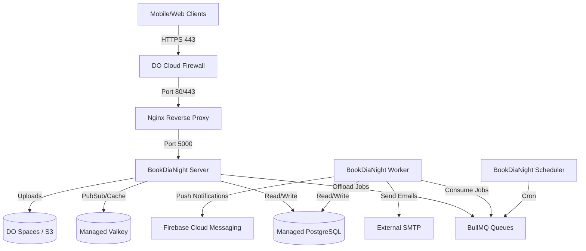
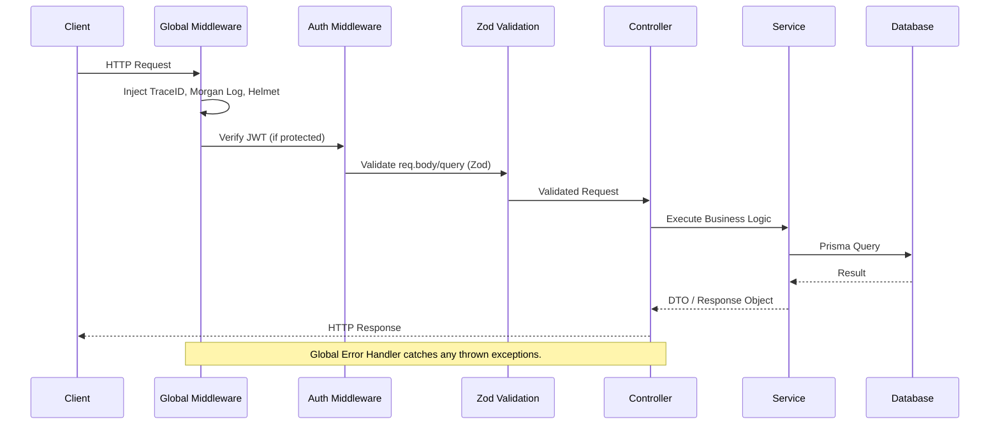

# Architecture Documentation

## 1. System Architecture

The BookDiaNight system represents a modern, containerized, multi-service backend hosted on DigitalOcean. 

### High-Level Topology



### Component Roles
- **DigitalOcean Cloud Firewall:** The primary boundary. It strictly limits SSH (Port 22) to specific admin IPs and dynamic GitHub Actions runners, while exposing 80/443 for public API traffic.
- **Nginx:** Terminates SSL (Let's Encrypt), redirects HTTP to HTTPS, and forwards API and WebSocket (`upgrade`) traffic to the internal Node.js server container.
- **Server Container:** The synchronous Express.js API. Handles authentication, validation, REST requests, and real-time Socket.IO communication.
- **Worker Container:** An asynchronous daemon. Consumes background jobs (emails, notifications, heavy logic) to keep the API server highly responsive.
- **Scheduler Container:** A cron-like daemon that strictly pushes time-based jobs into the Valkey queues to be executed by the worker.
- **Managed PostgreSQL:** The persistent, relational data store.
- **Managed Valkey (Redis):** Serves as the high-speed cache, the BullMQ job store, and the Pub/Sub backend for horizontal scaling of Socket.IO.
- **DO Spaces:** S3-compatible object storage for user avatars, club images, and event media.

---

## 2. Application Architecture

The Node.js services are built with strict **TypeScript** and leverage **Express.js**.

### Request Lifecycle



### Core Layers
1. **Application Bootstrap (`src/app.ts`)**: Initializes Express, connects to PostgreSQL/Valkey, mounts the global middleware, and wires the routing tree.
2. **Global Middleware (`src/app/middlewares/`)**: Injects `traceId`, manages standard security headers (`helmet`), standardizes CORS, and provides central error handling.
3. **Routing (`src/app/routes/`)**: Maps URI paths to specific controllers.
4. **Controllers (`src/app/modules/*/`)**: Responsible exclusively for parsing HTTP requests, invoking the correct service, and formatting the HTTP response (Status codes, JSON envelopes). Wrapped in an `asyncHandler` to eliminate `try/catch` boilerplate.
5. **Services (`src/app/modules/*/`)**: The core business logic. They do not know about HTTP (`req`/`res`). They execute the logic, interface with Prisma, or enqueue BullMQ jobs.
6. **Validation (`zod`)**: Schemas are defined in the module. Middleware strictly validates incoming data against the schema before it ever reaches the controller.
7. **Response Structure**: All API responses follow a strict, predictable JSON format:
    ```json
    {
      "status": 200,
      "success": true,
      "message": "Human readable message",
      "data": { ... },
      "traceId": "uuid-v4"
    }
    ```

---

## 3. Networking

The system operates across distinct network boundaries to ensure strict security isolation.

### Port Mappings
- **Publicly Accessible (0.0.0.0/0):**
  - `80` (HTTP) - Used only by Certbot for ACME validation and redirecting traffic to HTTPS.
  - `443` (HTTPS) - The primary API entry point.
- **Strictly Restricted (162.4.34.65/32):**
  - `22` (SSH) - Hardened admin access. Root login is disabled. Password authentication is disabled for the `deploy` user.
- **Internal / Blocked externally:**
  - `5000` (Node.js API) - Bound to host but firewalled off from the internet. Accessible only via Nginx.
  - `5432` / `25060` (PostgreSQL) - Managed database port.
  - `6379` / `25061` (Valkey) - Managed cache port.

---

## 4. Nginx & TLS

**Nginx** operates as a reverse proxy on the Ubuntu Droplet.

- **TLS / Let's Encrypt**: Certbot automatically requests and renews TLS certificates. Certificates are stored in `/etc/letsencrypt/`.
- **Certbot Timer**: A systemd timer (`certbot.timer`) runs twice daily to check for renewals, completely eliminating manual certificate management.
- **WebSocket Forwarding**: The Nginx configuration explicitly includes `Upgrade $http_upgrade` and `Connection 'upgrade'` headers to support seamless Socket.IO connections.
